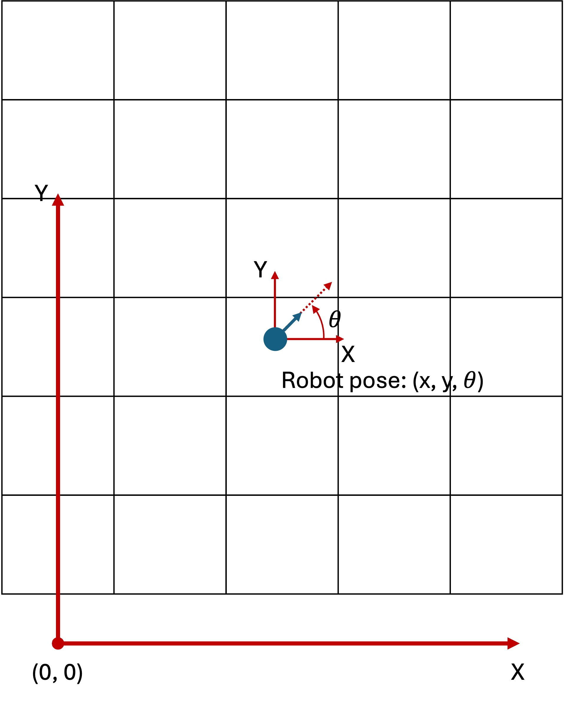
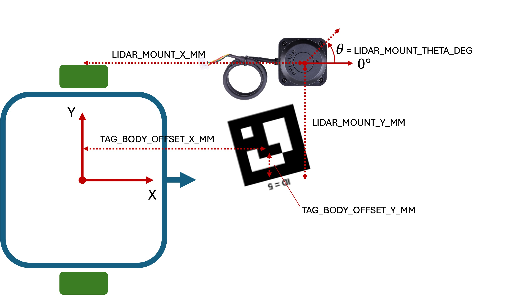
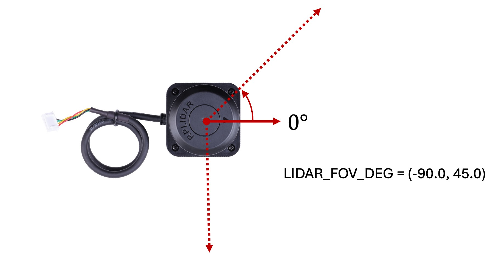
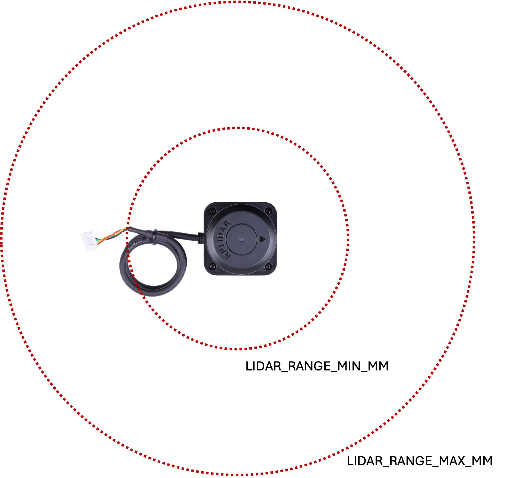

# GPS, Robot, and LiDAR Coordinates

This note explains the coordinate systems used by the current robot stack and
where to configure the GPS tag and LiDAR mounting geometry in the repo.

## 1. Global GPS Coordinates



The vision / ArUco pipeline publishes tag detections in a **world frame**. The
robot code then uses those detections as a global position correction source.

Key points:
- `get_pose()` and `get_fused_pose()` return pose in this world frame.
- Heading `theta` is in radians, measured **counter-clockwise from world +X**.
- New code should usually treat incoming GPS/tag detections as already being in
  the correct world frame.

### Optional GPS offset

There is still a legacy hook for applying a fixed translation to the incoming
GPS/tag coordinates:

- public API: `robot.set_gps_offset(offset_x_mm, offset_y_mm)`
- implementation: [sensors.py](../../../ros2_ws/src/robot/robot/robot_impl/sensors.py)

This applies:

```text
world_x = gps_x + offset_x
world_y = gps_y + offset_y
```

In the current stack, this should normally stay at `(0, 0)`. Use it only if
your GPS/tag source is known to be shifted from the arena/world frame.

## 2. Robot Body Frame



The robot body frame is the local coordinate system used by the motion, GPS,
and LiDAR APIs.

Origin:
- midpoint of the two drive wheels

Axes:
- `+x` = robot forward
- `+y` = robot left

Heading:
- positive rotation = counter-clockwise

This convention is used consistently in the Robot API, for example:
- [robot.py](../../../ros2_ws/src/robot/robot/robot.py)
- [sensors.py](../../../ros2_ws/src/robot/robot/robot_impl/sensors.py)

## 3. Hardware Calibration File

The shared default geometry lives in:

- [hardware_map.py](../../../ros2_ws/src/robot/robot/hardware_map.py)

Current defaults:

```python
LIDAR_MOUNT_X_MM = 0.0
LIDAR_MOUNT_Y_MM = 0.0
LIDAR_MOUNT_THETA_DEG = 0.0
LIDAR_RANGE_MIN_MM = 150.0
LIDAR_RANGE_MAX_MM = 6000.0
LIDAR_FOV_DEG = (-180.0, 180.0)

TAG_BODY_OFFSET_X_MM = 0.0
TAG_BODY_OFFSET_Y_MM = 0.0
```

Use `hardware_map.py` as the default calibration source for examples and robot
startup. You can also override these at runtime with Robot API calls.

## 4. GPS Tag Mounting Parameters

If the ArUco tag is not exactly at the robot body origin, tell the robot where
the tag is mounted in the **robot body frame**.

Public API:

```python
robot.set_tag_body_offset(x_mm, y_mm)
```

Meaning:
- `x_mm` = forward offset from wheel midpoint
- `y_mm` = left offset from wheel midpoint

The robot uses the current fused heading to rotate this body-frame offset into
the world frame and recover the body-origin position from the tag position.

Reference:
- [sensors.py](../../../ros2_ws/src/robot/robot/robot_impl/sensors.py)

### Example

If the tag is mounted 90 mm in front of the wheel midpoint and 25 mm to the
left:

```python
robot.set_tag_body_offset(90.0, 25.0)
```

## 5. LiDAR Mounting Parameters

The LiDAR is also described in the **robot body frame**.

Public API:

```python
robot.set_lidar_mount(x_mm, y_mm, theta_deg=0.0)
```

Meaning:
- `x_mm` = forward offset from wheel midpoint
- `y_mm` = left offset from wheel midpoint
- `theta_deg` = LiDAR heading offset relative to robot forward
  - positive = counter-clockwise
  - use `180.0` if the LiDAR is mounted facing backward

Reference:
- [sensors.py](../../../ros2_ws/src/robot/robot/robot_impl/sensors.py)

### Example

If the LiDAR is 60 mm forward of the wheel midpoint, centered laterally, and
facing forward:

```python
robot.set_lidar_mount(60.0, 0.0, 0.0)
```

If it is mounted facing backward:

```python
robot.set_lidar_mount(60.0, 0.0, 180.0)
```

## 6. LiDAR FOV and Range Parameters




The LiDAR filter settings are also configurable through the Robot API:

```python
robot.set_lidar_filter(
    range_min_mm=150.0,
    range_max_mm=6000.0,
    fov_deg=(-180.0, 180.0),
)
```

Meaning:
- `range_min_mm` = discard points closer than this to the **LiDAR origin**
- `range_max_mm` = discard points farther than this from the **LiDAR origin**
- `fov_deg = (min_deg, max_deg)` = keep only this angular window in the
  robot-aligned frame, **after** LiDAR installation (`LIDAR_MOUNT_THETA_DEG`)
  - `0°` = robot forward
  - positive angles are counter-clockwise
  - example: `(-90, 90)` keeps only the front hemisphere

Reference:
- [sensors.py](../../../ros2_ws/src/robot/robot/robot_impl/sensors.py)

### Filter order

The current LiDAR pipeline applies the filters in this order:

1. convert scan rays to LiDAR-frame Cartesian points
2. rotate by LiDAR mount heading
3. apply the FOV window in the robot-aligned frame
4. apply range limits relative to the LiDAR origin
5. translate by the LiDAR mount offset into the robot body frame

Reference:
- [sensors.py](../../../ros2_ws/src/robot/robot/robot_impl/sensors.py)

## 7. Raw LiDAR Convention vs Robot Convention

This is the part that most often causes confusion.

### Robot-side convention

Once the ROS `/scan` message reaches the robot package, the code treats it as:
- `0°` = forward
- positive angle = left / counter-clockwise
- Cartesian conversion:

```text
x = r cos(angle)
y = r sin(angle)
```

That is the standard right-handed robot / ROS convention used by:
- [lidar_scan.py](../../../ros2_ws/src/robot/robot/lidar_scan.py)
- [sensors.py](../../../ros2_ws/src/robot/robot/robot_impl/sensors.py)

### Raw RPLidar convention

The native RPLidar angle convention is effectively:
- `0°` at the lidar front
- positive angles sweep toward the **right** side of the robot for a standard
  forward-facing mount

So the raw/native convention is not the same as the robot convention.

### Where the convention changes

The conversion happens in the RPLidar ROS driver, before the robot code sees
the scan:

- [rplidar_c1_node.cpp](../../../ros2_ws/src/rplidar_ros/src/rplidar_c1_node.cpp)
- [rplidar_c1.launch.py](../../../ros2_ws/src/rplidar_ros/launch/rplidar_c1.launch.py)

With the current launch defaults:
- `inverted = false`
- `flip_x_axis = true`

the published ROS scan is effectively:

```text
ros_angle = - raw_lidar_angle
```

That is why the robot package can safely use the normal ROS convention on
`/scan`.

## 8. Recommended Workflow

For normal use:

1. set default geometry in [hardware_map.py](../../../ros2_ws/src/robot/robot/hardware_map.py)
2. in your example, call:
   - `robot.set_lidar_mount(...)`
   - `robot.set_lidar_filter(...)`
   - `robot.set_tag_body_offset(...)`
3. leave `set_gps_offset(0, 0)` unless you have measured a real global offset
4. verify geometry using:
   - obstacle points in the UI
   - GPS-corrected pose
   - a simple sensor test example such as [motion_basics.py](../../../ros2_ws/src/robot/robot/examples/motion_basics.py)

## 9. Summary

- **World / GPS frame**: global arena frame used by fused pose
- **Robot body frame**: origin at wheel midpoint, `+x` forward, `+y` left
- **Tag offset**: where the GPS / ArUco tag sits on the robot body
- **LiDAR mount**: where the LiDAR sits and which way it faces
- **LiDAR filter**: range and FOV limits in the robot-aligned frame
- **Raw RPLidar angles** are converted in the driver before the robot package
  uses them
